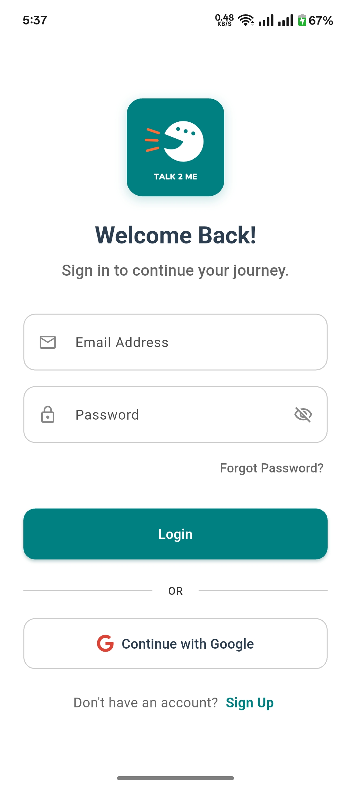
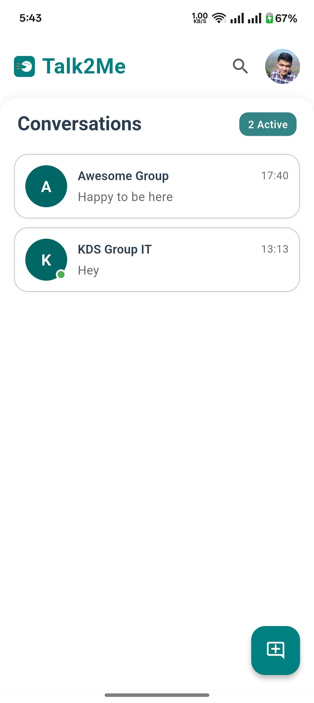
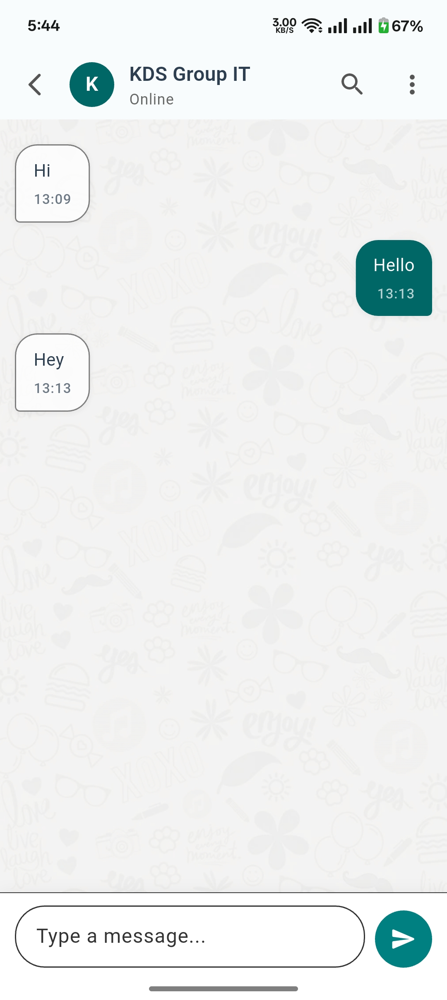
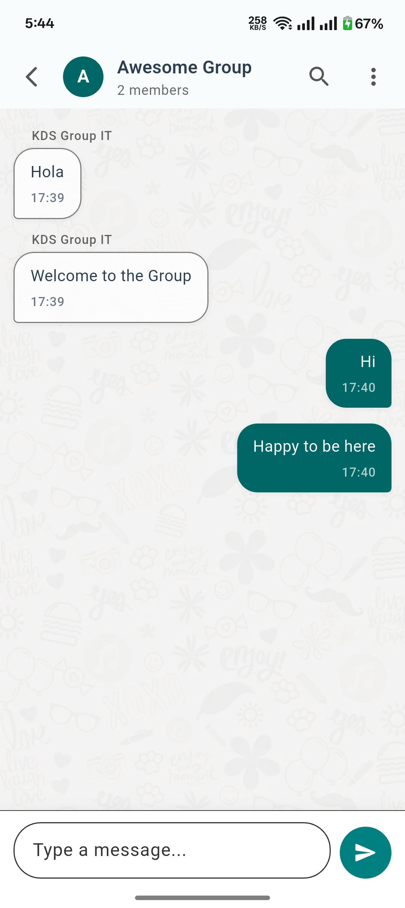
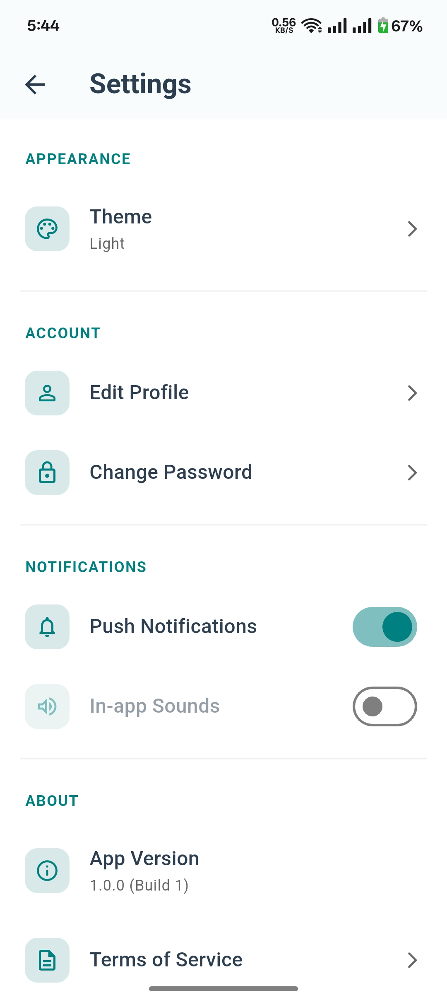

# Talk2Me - Flutter Chat Application

**Talk2Me** is a real-time chat application built with Flutter and Firebase. It allows users to sign up, log in, chat in one-on-one conversations, create and participate in group chats, and more. The app features a modern, themeable UI (supporting both light and dark modes) and real-time updates for messages and user presence.

## Features

* **User Authentication:**
    * Email/Password signup and login.
    * Google Sign-In.
    * Password reset functionality.
* **Real-time Chat:**
    * One-on-one private conversations.
    * Group chats with multiple participants.
    * Real-time message delivery.
    * Typing indicators to see when other users are typing.
    * Message read receipts (implicitly by marking messages as read).
* **User Presence:**
    * Online/Offline status indicators.
    * Last seen timestamps (for offline users, implemented in Firestore).
* **Chat Management:**
    * View a list of active conversations (both individual and group).
    * Start new individual chats with other users.
    * Create new group chats and add members.
* **User Profiles:**
    * View contact details (name, email, avatar, online status) for 1-on-1 chats.
    * User avatars (from Google Sign-In or placeholders).
* **Search Functionality:**
    * Search for users to start new conversations.
    * Search within a chat for specific messages.
* **Settings:**
    * Theme customization (Light, Dark, System default).
    * View app version.
    * Logout functionality.
    * Placeholders for profile editing, password change, and notification settings.
* **Modern UI/UX:**
    * Clean, responsive design.
    * Smooth animations and transitions.
    * Support for light and dark themes based on system settings or user preference.

## Screenshots

1.  **Authentication Screen (Login & Signup)**
    *Description: Shows the login form with an option to switch to the signup form, including email/password fields and Google Sign-In.*
    

2.  **Home Screen (Chat List)**
    *Description: Displays the list of active individual and group conversations, with last message previews and unread indicators.*
    

3.  **Chat Screen (1-on-1 Conversation)**
    *Description: Shows a typical one-on-one chat interface with message bubbles, sender names (if group), timestamps, and the message input area.*
    

4.  **Chat Screen (Group Conversation)**
    *Description: Illustrates a group chat, potentially showing different sender names and the group name in the AppBar.*
    

<!-- 5.  **New Chat/Group Creation Dialog**
    *Description: Shows the interface for searching users to start a new chat or for creating a new group and adding members.*
    `` -->

5.  **Settings Screen**
    *Description: Displays the settings options, including theme selection, account info, and logout.*
    


## Technologies Used

* **Flutter:** For building the cross-platform mobile application.
* **Dart:** Programming language for Flutter.
* **Firebase:** Backend-as-a-Service (BaaS)
    * **Firebase Authentication:** For user sign-up, sign-in (Email/Password, Google).
    * **Cloud Firestore:** NoSQL database for storing user data, chat messages, and chat metadata.
    * **Firebase Storage (Optional):** Could be used for storing media attachments in messages (not implemented in the current scope).
* **State Management:** (Specify your chosen solution, e.g., Provider, Riverpod, BLoC. If none explicitly set up yet, you can omit or mention Flutter's built-in `StatefulWidget`/`setState`).
* **Packages:**
    * `cloud_firestore`: For Firestore database interaction.
    * `firebase_auth`: For Firebase Authentication.
    * `google_sign_in`: For implementing Google Sign-In.
    * `flutter_animate`: For UI animations.
    * `intl`: For date/time formatting.
    * `font_awesome_flutter`: For social icons (like Google).
    * `package_info_plus`: For retrieving app version information.

## Project Structure (Illustrative)

talk2me_flutter_app/├── android/├── ios/├── lib/│   ├── main.dart                 # App entry point, MaterialApp setup│   ├── app_colors.dart           # (If still used, otherwise theming is in main.dart)│   ├── models/│   │   └── chat_message.dart     # Data model for chat messages│   ├── screens/│   │   ├── auth_screen.dart      # Login, Signup, Password Reset│   │   ├── home_screen.dart      # Displays chat list, user list, FABs│   │   ├── chat_screen.dart      # Individual and group chat interface│   │   └── settings_screen.dart  # App settings│   ├── widgets/                  # (If you have custom reusable widgets)│   │   └── custom_text_field.dart # Example custom widget│   │   └── custom_button.dart    # Example custom widget│   └── providers/                # (If using Provider/Riverpod for state management)│       └── theme_provider.dart   # Example for theme state├── assets/│   ├── logo.png                  # App logo│   ├── images/│   │   └── chat_bg.png           # Background image for chat screen│   └── screenshots/              # (Recommended folder for your screenshots)│       ├── auth_screen.png│       └── ...├── test/└── pubspec.yaml                  # Project dependencies and metadata

## Setup and Installation

### Prerequisites

* Flutter SDK (latest stable version recommended)
* An IDE like Android Studio or VS Code with Flutter plugins.
* A Firebase project set up.

### Firebase Configuration

1.  **Create a Firebase Project:** Go to the [Firebase Console](https://console.firebase.google.com/) and create a new project.
2.  **Register Your App:**
    * Add an Android app to your Firebase project:
        * Use your app's package name (e.g., `com.example.talk2me_flutter_app`).
        * Download the `google-services.json` file and place it in the `android/app/` directory.
        * Follow the instructions to add Firebase SDKs to your Android project (usually involves modifying `build.gradle` files).
    * Add an iOS app to your Firebase project:
        * Use your app's iOS bundle ID.
        * Download the `GoogleService-Info.plist` file and add it to your Xcode project (usually via Xcode, placing it in the `ios/Runner/` directory).
3.  **Enable Authentication Methods:**
    * In the Firebase Console, go to "Authentication" -> "Sign-in method".
    * Enable "Email/Password" and "Google" sign-in providers.
    * For Google Sign-In on Android, ensure you add your SHA-1 fingerprint to the Firebase project settings. You can get it using:
        ```bash
        cd android
        ./gradlew signingReport
        ```
4.  **Set up Cloud Firestore:**
    * In the Firebase Console, go to "Firestore Database".
    * Create a database. Start in **test mode** for initial development (allows open read/write access).
        ```
        // Example Firestore rules for testing (NOT FOR PRODUCTION)
        rules_version = '2';
        service cloud.firestore {
          match /databases/{database}/documents {
            match /{document=**} {
              allow read, write: if true;
            }
          }
        }
        ```
    * **Important:** For production, you MUST set up proper security rules to protect your data (e.g., only authenticated users can read/write their own data or chats they are part of).

### Local Setup

1.  **Clone the Repository (if applicable):**
    ```bash
    git clone <your-repository-url>
    cd talk2me_flutter_app
    ```
2.  **Install Dependencies:**
    ```bash
    flutter pub get
    ```
3.  **Ensure Assets:**
    * Make sure you have the `assets/logo.png` and `assets/images/chat_bg.png` files in the correct locations.
    * Update your `pubspec.yaml` to include the assets folder:
    ```yaml
    flutter:
      uses-material-design: true
      assets:
        - assets/
        - assets/images/
    ```
    Then run `flutter pub get` again if you modified `pubspec.yaml`.

## Running the Application

1.  **Connect a Device or Start an Emulator/Simulator.**
2.  **Run the App:**
    ```bash
    flutter run
    ```

## Future Enhancements (Possible To-Do)

* **Media Sharing:** Allow users to send images, videos, or other files.
* **Message Reactions:** Add emoji reactions to messages.
* **Advanced User Profiles:** More detailed user profiles with status messages, etc.
* **Push Notifications:** Implement Firebase Cloud Messaging (FCM) for background notifications.
* **End-to-End Encryption (Advanced):** For enhanced privacy.
* **Message Deletion/Editing:** Allow users to delete or edit their sent messages.
* **More Robust Error Handling and UI Feedback.**

## Contributing

Pull requests are welcome. For major changes, please open an issue first.
Let’s build something cool together 🧠⚡

---

## License

[MIT](LICENSE)

---
